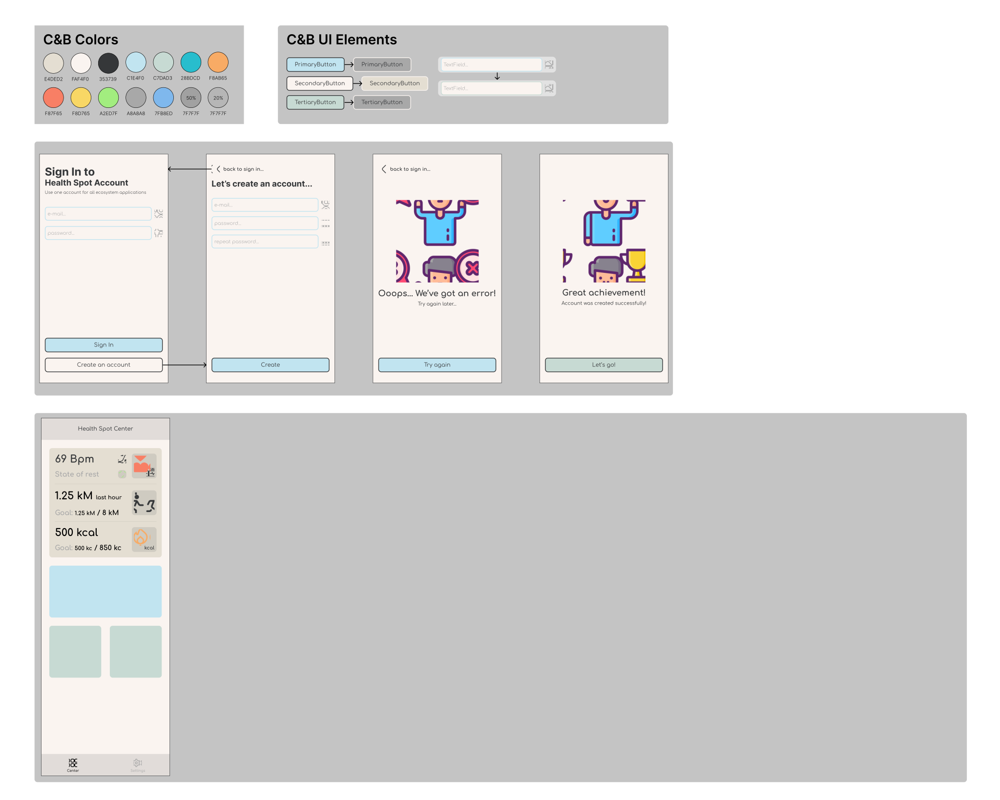

# HealthSpotApp

## **HealthSpot UI**

### Figma: 

**Что же это и кому надо?**
Все мы хотим быть здоровенькими и чтобы это было удобно я начинаю разработку небольшой экосистемы iOS - приложений для контроля этого вашего здоровья (кхе-кхе)

Пока что планируется 3 приложения:

## **Pocket Medicine Checker**

Приложение для контроля приёма лекрств, которое позволяет:
- Сканировать штрих-коды на упаковках медикаментов (тем самым добавляя их в систему)
- После добавления будет возможность заказать лекарства (пока что в поисках прекрасных API аптек, так что да, аптеки, свяжитесь со мной (кхе-кхе))
- Настройка графика уведомлений по приёму лекарств

## **Weekly Home Chief**

Приложение для составления рациона здорового питания, исходя из предпочтений пользователя

## **Health Spot**

ГЛАВНОЕ РАДИ ЧЕГО МЫ ВСЕ ЗДЕСЬ СЕГОДНЯ СОБРАЛИСЬ

Приложение позволяет отслеживать активность человека
- Подвижность человека в течение дня
- Контроль пульса
- Контроль приёма жидкости

Также Health Spot является связующим звеном между первыми двумя приложениями, оно собирает информацию с каждого из установленных приложений экосистемы и отображает необходимую на данный момент, например:
- Для (WHC) это блюда на текущий день с возможностью просмотра рецептов
- Для (PMC) ближайший приём лекарств

Все приложения будут работать под общей учётной записью, а регистрация и авторизация построена на Firebase 

### P.S. Приложения написаны на лучшем в мире языке программирования - Swift
